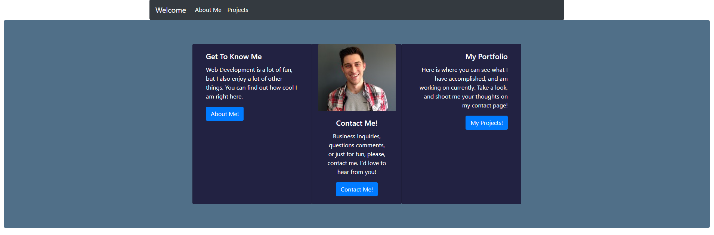
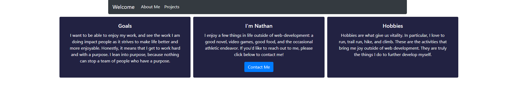
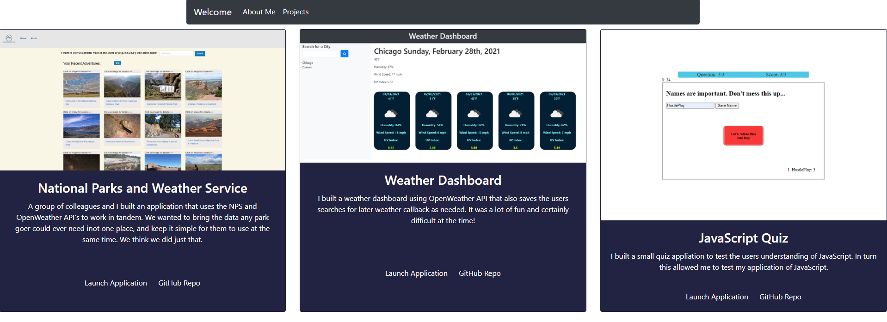

## Responsive-Portfolio

As a user I want to be greeted by a welcome that gives options. I want to be able to get know Nathan, as well as see what he's been working on.

## Installation
Nothing is required of the User

## Usage
- When I enter the welcome page 
- I am greeted with the option to navigate through the portfolio
- When I navigate to the contact Page
- I am given the option to email Nathan directly
- When I click on the About or Portfolio tabs
- I am taken to their respective pages

## License
- MIT License

## Screenshots

## Features
1. BootStrap
    https://getbootstrap.com/docs/4.6/getting-started/introduction/

## Links
1. [github.io](https://nathanforgille.github.io/Responsive-Portfolio/) 
2. [github](https://github.com/NathanForgille/Responsive-Portfolio)

## Authors
- Nathan Forgille

## Authors of NPWS Project Listed in Portfolio
- Morgan Franke
- Tolga Secme
- Rob Koch
- Nathan Forgille
